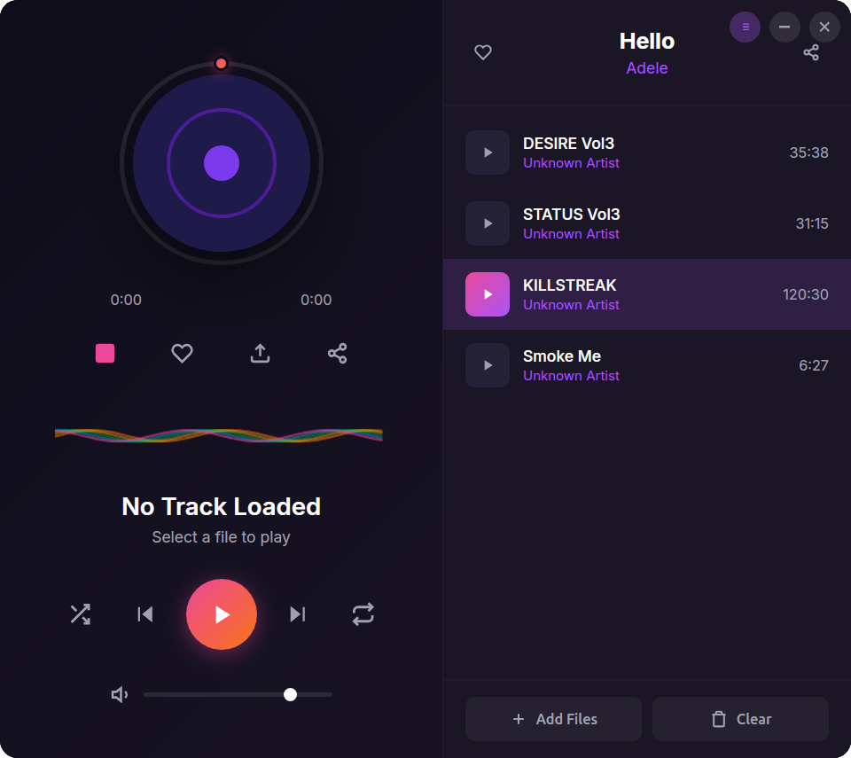
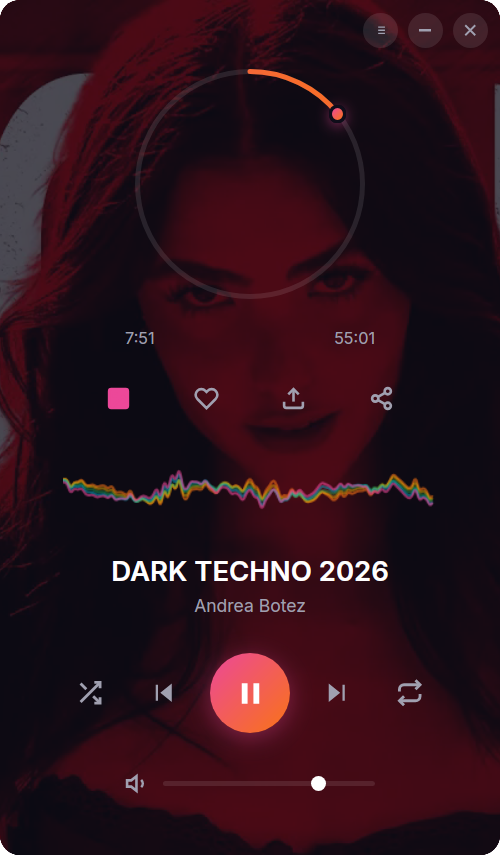

# Winamp Clone

A cross-platform MP3 player with classic Winamp aesthetics, built with Tauri + Rust + Vanilla JS.





## Features

- Classic Winamp visual style with LCD display
- Transparent, frameless window
- Play/Pause/Stop/Next/Previous controls
- Volume control
- Seek bar
- Playlist support (add/remove/clear)
- Shuffle and repeat modes
- Animated visualizer
- Keyboard shortcuts
- Cross-platform (Windows, macOS, Linux)

## Prerequisites

1. **Rust** (latest stable)
   ```bash
   curl --proto '=https' --tlsv1.2 -sSf https://sh.rustup.rs | sh
   ```

2. **System dependencies** (Linux only)
   ```bash
   # Ubuntu/Debian
   sudo apt update
   sudo apt install libwebkit2gtk-4.1-dev build-essential curl wget file \
       libssl-dev libayatana-appindicator3-dev librsvg2-dev \
       libasound2-dev  # For audio playback
   
   # Fedora
   sudo dnf install webkit2gtk4.1-devel openssl-devel curl wget file \
       libappindicator-gtk3-devel librsvg2-devel alsa-lib-devel
   
   # Arch
   sudo pacman -S webkit2gtk-4.1 base-devel curl wget file openssl \
       libappindicator-gtk3 librsvg alsa-lib
   ```

3. **Tauri CLI**
   ```bash
   cargo install tauri-cli
   ```

## Setup

1. **Clone/download this project**

2. **Add icons** (required for build)
   
   Add the following files to `src-tauri/icons/`:
   - `32x32.png`
   - `128x128.png`
   - `128x128@2x.png`
   - `icon.icns` (macOS)
   - `icon.ico` (Windows)

   You can generate placeholder icons:
   ```bash
   # Using ImageMagick
   convert -size 32x32 xc:'#1a3a1a' src-tauri/icons/32x32.png
   convert -size 128x128 xc:'#1a3a1a' src-tauri/icons/128x128.png
   convert -size 256x256 xc:'#1a3a1a' src-tauri/icons/128x128@2x.png
   
   # For .ico and .icns, use online converters or:
   # macOS: iconutil
   # Windows: use the png as base
   ```

## Development

```bash
cd winamp-clone
cargo tauri dev
```

This starts the app in development mode with hot-reload.

## Build for Production

```bash
cargo tauri build
```

Outputs:
- **Windows**: `src-tauri/target/release/bundle/msi/` or `nsis/`
- **macOS**: `src-tauri/target/release/bundle/dmg/` or `app/`
- **Linux**: `src-tauri/target/release/bundle/deb/` or `appimage/`

## Keyboard Shortcuts

| Key | Action |
|-----|--------|
| Space | Play/Pause |
| ← | Seek backward 5% |
| → | Seek forward 5% |
| ↑ | Volume up |
| ↓ | Volume down |

## Project Structure

```
winamp-clone/
├── src/
│   ├── index.html    # Main HTML structure
│   ├── style.css     # Winamp-style CSS
│   └── main.js       # UI logic and Tauri bindings
├── src-tauri/
│   ├── src/
│   │   └── main.rs   # Rust backend (audio playback)
│   ├── Cargo.toml    # Rust dependencies
│   ├── tauri.conf.json
│   └── icons/
└── README.md
```

## Customization

### Changing the skin colors

Edit `src/style.css`. Key color variables:
- Green theme: `#1a3a1a`, `#2a5a2a`, `#00ff00`
- Display background: `#0a1a0a`
- Metal frame: `#4a4a4a`, `#2a2a2a`

### Window size

Edit `src-tauri/tauri.conf.json`:
```json
"windows": [{
  "width": 275,
  "height": 348
}]
```

## Known Limitations

- Seek position tracking is approximate (rodio doesn't expose exact position)
- Visualizer is simulated (no real FFT analysis)
- Balance slider is visual only (rodio doesn't support panning easily)

## License

MIT


```
+ close and minimize buttons do not work
+ song seek doesn't work
+ make playlist panel toggleable
+ allow main window to be movable


+ window move doesn't work
+ after seeking song audio stops
+ when toggle playlist panel shrink width
+ remember window position on screen
+ remember playlist between restarts
+ playlist panel is not shown by default
+ when playlist is toggled, toggle button should be purple not the other way around
+ make window edges round - keep in mind to do the same when playlist panel is shown
+ display cover image that is the same name as mp3 file and is beside mp3 file
+ make text in playlist not selectable when double clicked the song - do the same throughout the ui where needed
+ add option to show cover art as player background or where it is now
- player background cover art button when on is purple and is standing out too much from design 
+ song duration not shown in playlist
+ when showing cover art as player background, circle inside seek bar should be transparent
- when showing cover art as player background, cover art should be centered and scaled to fit in the player (test this)
+ top of playlist where is song title and artist should be truncated to achieve same size no matter the song name/file name length
+ change screenshot to actual app screenshot


- create a feature that will allow to paste yt video and run yt-dlp to download mp3 and covert/thumbnail
   - (./yt-dlp -x --audio-format mp3 --audio-quality 0 --write-thumbnail --convert-thumbnails png https://www.youtube.com/watch?v=96zLSjw_FBg)
```